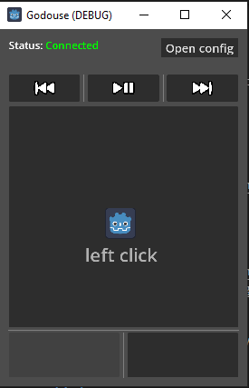
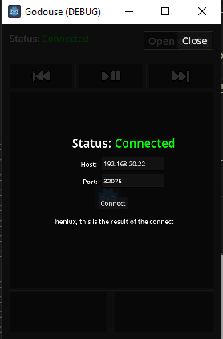
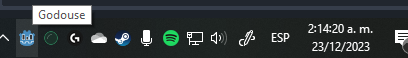

# GODOUSE
Remote mouse controller made with godot and c++ gdextensions

client (Android), server (windows)

# Development 

## Master submodule command

	git submodule update --init --recursive

## Create an android debug keystore

	mkdir -p /home/<your_user_name>/.local/share/godot/keystores && \
		keytool -genkeypair -alias androiddebugkey -keyalg RSA -keysize 2048 \
		-validity 10000 \
		-keystore /home/<your_user_name>/.local/share/godot/keystores/debug.keystore \
		-storepass android \
		-keypass android \
		-dname "CN=Android Debug,O=Android,C=US"

## Building gdextensions

### Android

Setup env variables for android gdextensions builds (`CLANG_PATH`, `CARGO_TARGET_{shoutTargetTriple}_LINKER`)

https://godot-rust.github.io/book/toolchain/export-android.html

### building

use the tasks at [.vscode/tasks.json](./.vscode/tasks.json) or [godouse-rust-gdextensions/.vscode/tasks.json](godouse-rust-gdextensions/.vscode/tasks.json) for building the gdextensions for godot

# Features
- Platforms: [windows,android]
- Remote cursor position controller
- Media buttons (play/pause,next track, previous track)
- Left/Right Click

# TODO
- Android safe area
- Add the application to the system tray, https://github.com/jmariner/traypp
- Support to other platforms
- Cursor sensibility

# Third party

## XInputSimulator

- Upstream: https://github.com/pythoneer/XInputSimulator
- XInputSimulator folder without root content
- commit 19d5be6dfc4cda837f2395713fdd6475ace32314
- location: godouse-cpp-gdextensions\XInputSimulator

## traypp

- Upstream: https://github.com/jmariner/traypp
- commit f876fdf6d2ac283f7a85fce14e3e3d538c0abbe6
- location: godouse-cpp-gdextensions\traypp

# Useful stuff
- Construction variables: https://scons.org/doc/0.96.90/HTML/scons-user/a3061.html
- CXX (CMAKE) location: C:\Program Files (x86)\Microsoft Visual Studio\2019\Community\Common7\IDE\CommonExtensions\Microsoft\CMake\CMake\bin\cmake.exe